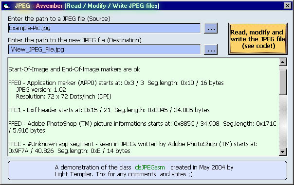



## RDY2USE:   clsJPEGasm   VB class to READ/MODIFY/WRITE a JPEG structure

### Description

A selfcontained class based on my class clsJPEGparser to ***READ in a JPEG file ***Parse the underlying structure (segments) ***Get a list with start and size of segments ***Isolate the comments ***Add/modify/remove comments ***Remove some segments on demand (Exif, Adobe (TM) PhotoShop header, all application specific headers, all comments) ***Get important informations (like the TRUE size (width/height) of the image even when there is a Adobe PhotoShop (TM) preview included ..., parseable without errors and so on) ***WRITE out a new JPEG file 

----

THIS IS NOT AN IMAGE MANIPULATION CLASS OR SOMETHING TO SHOW THE PICTURE - WE HANDLE THE UNDERLYING (COMPLEX) STRUCTURE OF JPEGS 

----

A sample is included --- RDY2USE ___Comments are welcome, votes are motivating ;) 

----

LiTe
 
### More Info
 

             |
---                |---
**Submitted On**   |2004-08-04 14:15:32
**By**             |[Light Templer](https://github.com/Planet-Source-Code/PSCIndex/blob/master/ByAuthor/light-templer.md)
**Level**          |Advanced
**User Rating**    |5.0 (95 globes from 19 users)
**Compatibility**  |VB 5\.0, VB 6\.0
**Category**       |[Data Structures](https://github.com/Planet-Source-Code/PSCIndex/blob/master/ByCategory/data-structures__1-33.md)
**World**          |[Visual Basic](https://github.com/Planet-Source-Code/PSCIndex/blob/master/ByWorld/visual-basic.md)
**Archive File**   |[RDY2USE\_\_\_177766842004\.zip](https://github.com/Planet-Source-Code/light-templer-rdy2use-clsjpegasm-vb-class-to-read-modify-write-a-jpeg-structure__1-55345/archive/master.zip)

